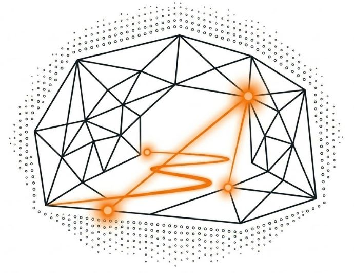
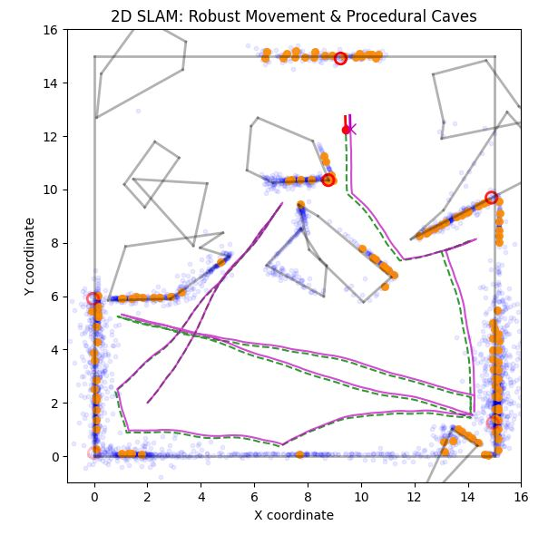

# Cave SLAM




`Cave SLAM` is a small 2D simulation project for exploring SLAM-related ideas in a visually inspectable way. It combines:

- procedural cave-like environment generation
- a simple 2D lidar model with configurable noise
- corner-style feature extraction from lidar returns
- EKF-based state estimation with pose-only and full EKF-SLAM modes
- accumulated point-cloud mapping with voxel-grid averaging
- a reactive agent controller with obstacle avoidance

The project is intentionally lightweight. It is designed to be easy to modify, inspect, and use for experimentation rather than to serve as a production robotics stack.



## Project Status

The current refactored entry point is:

- [cave_slam_3.py](/home/jon/cave_slam/cave_slam_3.py)

Detailed EKF development planning is documented here:

- [documentation/ekf_roadmap.md](/home/jon/cave_slam/documentation/ekf_roadmap.md)

Detailed EKF implementation notes are documented here:

- [EKF.md](/home/jon/cave_slam/EKF.md)

The original monolithic reference version is preserved here:

- [cave_slam_2.py](/home/jon/cave_slam/cave_slam_2.py)

Older exploratory scripts are stored in:

- [old_scripts](/home/jon/cave_slam/old_scripts)

## Repository Layout

```text
cave_slam/
├── README.md
├── EKF.md
├── cave_slam.yaml
├── cave_slam_2.py
├── cave_slam_3.py
├── examples/
│   ├── headless_experiment.py
│   └── visual_runner.py
├── requirements.txt
├── cave_slam/
│   ├── __init__.py
│   ├── agent.py
│   ├── ekf.py
│   ├── sim.py
│   ├── slam.py
│   └── viz.py
└── old_scripts/
```

### Module Responsibilities

- [cave_slam/slam.py](/home/jon/cave_slam/cave_slam/slam.py)
  - lidar ray casting and measurement generation
  - sensor noise model
  - landmark extraction from local scan geometry
  - landmark track, association, and gating logic
  - point-cloud transformation
  - voxel-grid aggregation
  - EKF prediction and low-level estimator math

- [cave_slam/agent.py](/home/jon/cave_slam/cave_slam/agent.py)
  - agent motion state
  - path-clear / bumper logic
  - weighted freer-side obstacle avoidance
  - startup spin behavior
  - movement stepping

- [cave_slam/ekf.py](/home/jon/cave_slam/cave_slam/ekf.py)
  - feature-observation association orchestration
  - match prioritization for correction
  - pose-only EKF correction flow
  - full-SLAM correction and landmark augmentation flow

- [cave_slam/sim.py](/home/jon/cave_slam/cave_slam/sim.py)
  - typed configuration models and validation
  - procedural environment generation
  - runtime state containers
  - headless simulation stepping
  - top-level `observe -> update -> map -> move -> predict` coordination without plotting concerns

- [cave_slam/viz.py](/home/jon/cave_slam/cave_slam/viz.py)
  - Matplotlib backend setup
  - plotting artist creation
  - rendering of simulation state
  - animation loop and interactive runtime orchestration

- [cave_slam_3.py](/home/jon/cave_slam/cave_slam_3.py)
  - minimal CLI runner that loads a config and starts the simulation

- [examples/headless_experiment.py](/home/jon/cave_slam/examples/headless_experiment.py)
  - demonstrates headless stepping and prints a textual run summary

- [examples/visual_runner.py](/home/jon/cave_slam/examples/visual_runner.py)
  - demonstrates running the interactive visualization from the examples folder

## Requirements

The project currently depends on:

- `matplotlib`
- `numpy`
- `PyYAML`

These are listed in [requirements.txt](/home/jon/cave_slam/requirements.txt).

## Architecture

The current refactor separates the project into three layers:

- domain logic
  - [cave_slam/slam.py](/home/jon/cave_slam/cave_slam/slam.py) and [cave_slam/agent.py](/home/jon/cave_slam/cave_slam/agent.py)
- headless simulation engine
  - [cave_slam/sim.py](/home/jon/cave_slam/cave_slam/sim.py)
- visualization and interactive runtime
  - [cave_slam/viz.py](/home/jon/cave_slam/cave_slam/viz.py)

This means you can:

- run the interactive Matplotlib simulation through [cave_slam_3.py](/home/jon/cave_slam/cave_slam_3.py)
- import the package without triggering Matplotlib setup
- create a simulation and advance it frame-by-frame in headless code using `create_simulation()` and `step_simulation()`

## Setup

### 1. Create and activate a virtual environment

```bash
python3 -m venv .venv
source .venv/bin/activate
```

### 2. Install dependencies

```bash
pip install -r requirements.txt
```

### 3. Run the simulation

```bash
python cave_slam_3.py
```

To use a specific config file:

```bash
python cave_slam_3.py --config cave_slam.yaml
```

If you prefer to call the virtualenv interpreter directly:

```bash
.venv/bin/python cave_slam_3.py --config cave_slam.yaml
```

### 4. Try the examples

Headless experiment:

```bash
python examples/headless_experiment.py --config cave_slam.yaml --steps 200 --summary-every 50
```

Visual runner:

```bash
python examples/visual_runner.py --config cave_slam.yaml
```

## How the Simulation Works

At a high level, each animation frame follows this loop:

1. The agent pose is used to simulate a lidar scan against the wall geometry.
2. The scan is converted into local measurements.
3. Corner-like landmarks are extracted from the scan.
4. Feature observations are associated to the landmark track layer.
5. The landmark track layer is updated and may create new landmark tracks.
6. Depending on `ekf.mode`, the estimator performs either pose-only correction or full EKF-SLAM landmark augmentation and update.
7. Measurements are transformed into world coordinates using the corrected observation-time EKF pose.
8. The point cloud is accumulated and averaged into a voxel grid.
9. The agent controller chooses and applies a motion command.
10. Odometry noise is added to the command.
11. The EKF prediction step advances the estimator to the post-motion state.
12. Matplotlib artists are refreshed for display.

This is now an explicit `observe -> update -> map -> move -> predict` timing model.

The first eleven steps are now handled by the headless simulation engine in [cave_slam/sim.py](/home/jon/cave_slam/cave_slam/sim.py). The final display step is handled separately in [cave_slam/viz.py](/home/jon/cave_slam/cave_slam/viz.py).

### Environment Model

The environment is a bounded 2D world made of line-segment walls.

Two modes are supported:

- generated environment
  - random polygons are placed inside the bounding box
- manual wall list
  - explicit wall segments are supplied in YAML

The generator can be controlled through complexity, world size, polygon area range, and boundary overlap behavior.

### Lidar Model

The lidar model in [cave_slam/slam.py](/home/jon/cave_slam/cave_slam/slam.py) casts rays across a configurable field of view. For each ray:

- the nearest wall intersection is found
- optional range-dependent noise is added
- hit measurements are retained for mapping and feature extraction
- full scan samples are retained for obstacle-avoidance logic

The forward sector is also tracked so the controller can estimate how close an obstacle is directly ahead.

### Landmark Extraction

The current feature extraction stage looks for corner-like structures in the ordered lidar returns. It does this by:

- converting neighboring scan samples into local 2D points
- fitting line directions to a small left and right window
- checking span, continuity, residual error, and corner angle
- applying non-maximum suppression to avoid dense duplicate detections

Detected landmarks are also passed into a separate landmark track layer used by the estimator. That track layer maintains:

- stable integer track IDs
- running landmark positions
- observation counts
- last-seen frame tracking
- track quality scores

The old visual persistence layer is still used for display, but EKF association now works against the dedicated track layer rather than the display-only landmark list.

### Mapping

The simulation keeps two related map views:

- raw accumulated point cloud
- voxel-grid averaged points

The voxel grid reduces visual clutter by fusing repeated returns that fall into the same spatial cell once a minimum point count is reached.

The current implementation is no longer a simple lifetime mean of all points in a cell. Each voxel now keeps weighted fusion state and updates over time as the robot revisits the same area.

The current voxel fusion supports:

- weighted updates, using either inverse-variance or inverse-distance weighting
- temporal decay, so older observations gradually lose influence
- optional best-observation override, so close confident hits can sharpen a voxel instead of being blurred by older long-range points

In practice this means:

- long-range early observations do not dominate forever
- short-range observations can progressively refine the same cell
- the displayed voxel point can either be the weighted fused centroid or, for close confident hits, a sharper best-observation position

The two weighting modes behave as follows:

- `inverse_variance`
  - uses the lidar noise model, so measurements with lower estimated uncertainty get higher weight
- `inverse_distance`
  - uses a distance-based weight of `1 / distance^p`, where `p` is `distance_weight_power`

Temporal decay is applied per frame, which makes the map more adaptable when the same area is observed again under better conditions.

### Motion and Obstacle Avoidance

The agent controller in [cave_slam/agent.py](/home/jon/cave_slam/cave_slam/agent.py) supports:

- startup spin-in-place behavior
- random wandering when the path is clear
- obstacle-triggered avoidance with hysteresis
- a simple bumper check before committing motion

The current avoidance strategy is a weighted freer-side selector:

- left and right scan sectors are scored separately
- sector scores are weighted by `cos(angle)^2`, so rays closer to straight ahead matter more
- the agent chooses the side with greater available clearance
- once chosen, that direction is retained until the obstacle is considered cleared

This avoids the per-frame oscillation that occurs if the controller randomly re-chooses left or right every update.

### EKF Estimation

The estimator now supports two runtime modes:

- `pose_only`
  - the EKF state is just robot pose `[x, y, theta]`
  - corrections can use either the truth harness or associated landmark tracks
- `full_slam`
  - the EKF state is augmented to `[x, y, theta, l1x, l1y, l2x, l2y, ...]`
  - matched tracked landmarks receive full-state EKF updates
  - newly created tracks can be inserted into the EKF state through landmark augmentation

The key EKF features currently implemented are:

- prediction hardening with angle normalization and covariance repair
- range-bearing measurement model
- truth-landmark observation harness for controlled testing
- landmark track layer with stable track IDs
- nearest-neighbor and Mahalanobis association modes
- ambiguity rejection for near-tied association candidates
- confidence-sorted correction updates, so the strongest matches are applied first
- pose-only EKF correction
- delayed landmark initialization for `full_slam`
- full EKF-SLAM state augmentation and full-state landmark updates
- per-step EKF diagnostics and live overlay text

See [EKF.md](/home/jon/cave_slam/EKF.md) for a detailed estimator description.

## Running the Refactored Version

The recommended script is [cave_slam_3.py](/home/jon/cave_slam/cave_slam_3.py):

```bash
python cave_slam_3.py
```

It simply:

1. parses `--config`
2. loads and validates the YAML config against typed config models
3. calls `run_simulation(config)` from [cave_slam/viz.py](/home/jon/cave_slam/cave_slam/viz.py)

If you want to drive the simulation programmatically, the public package entry points are exposed from [cave_slam/__init__.py](/home/jon/cave_slam/cave_slam/__init__.py):

```python
from cave_slam import load_config, run_simulation

config = load_config("cave_slam.yaml")
run_simulation(config)
```

For headless stepping without plotting:

```python
from cave_slam import create_simulation, load_config, step_simulation

config = load_config("cave_slam.yaml")
state = create_simulation(config)

for _ in range(100):
    result = step_simulation(state)
```

`step_simulation()` returns a typed `StepResult` object containing the frame observation pose, lidar scan, extracted landmarks, chosen motion command, and noisy odometry values.
It also includes association results, EKF diagnostics, and any landmark track IDs that were augmented into the EKF state during that frame.

## Configuration

Runtime configuration is loaded from YAML, merged with defaults, and converted into typed configuration objects defined in [cave_slam/sim.py](/home/jon/cave_slam/cave_slam/sim.py). The default file in the repository is [cave_slam.yaml](/home/jon/cave_slam/cave_slam.yaml).

The main typed config root is `AppConfig`, which contains nested config sections such as:

- `SimulationConfig`
- `EnvironmentConfig`
- `SensorConfig`
- `FeatureExtractionConfig`
- `MotionConfig`
- `OdometryNoiseConfig`
- `VoxelGridConfig`
- `AgentConfig`
- `PlotConfig`
- `EkfConfig`

### `simulation`

- `delay_ms`
  - delay between animation frames in milliseconds
- `frames`
  - total number of animation frames
- `random_seed`
  - random seed for reproducible runs

### `environment.generator`

- `enabled`
  - when `true`, use procedural environment generation
- `complexity`
  - approximate number of polygonal obstacles to create
- `width`
  - world width
- `height`
  - world height
- `overlap_boundaries`
  - whether generated obstacles may extend across the room boundary
- `min_area`
  - minimum polygon area
- `max_area`
  - maximum polygon area

### `environment.walls`

Used when `environment.generator.enabled: false`.

Each wall is a line segment of the form:

```yaml
walls:
  - [[0, 0], [10, 0]]
  - [[10, 0], [10, 10]]
```

### `sensor`

- `fov_degrees`
  - lidar field of view in degrees
- `num_rays`
  - number of rays per scan
- `max_range`
  - maximum measurable distance

### `sensor.noise`

- `enabled`
  - enables range noise
- `min_relative_std`
  - lower bound on relative range standard deviation
- `max_relative_std`
  - upper bound on relative range standard deviation

The sensor noise grows with distance.

### `feature_extraction`

- `window_size`
  - number of neighboring points used on each side of a candidate feature
- `max_neighbor_gap`
  - maximum allowed gap between neighboring scan points
- `min_segment_span`
  - minimum spatial extent of each side of a candidate corner
- `max_line_residual`
  - maximum acceptable point-to-line deviation
- `min_corner_angle_deg`
  - minimum allowed corner angle
- `max_corner_angle_deg`
  - maximum allowed corner angle
- `nms_radius`
  - non-maximum suppression radius in scan index space
- `persistence_frames`
  - lifetime of landmarks once detected
- `association_radius`
  - spatial threshold for associating landmarks across frames

### `motion`

- `linear_speed`
  - forward distance per frame during normal motion
- `random_turn_deg`
  - random steering jitter applied during free motion
- `collision_turn_deg`
  - turn applied during obstacle avoidance
- `collision_distance`
  - threshold for detecting an obstacle ahead
- `clear_distance`
  - distance required before avoidance can be exited
- `clearance_frames`
  - number of consecutive clear frames required to exit avoidance
- `front_sector_deg`
  - forward angular band used for obstacle detection and side scoring separation
- `side_balance_tolerance`
  - threshold below which left and right sector scores are treated as effectively tied

Note:
The current repository YAML does not include every motion field. Missing values are filled from code defaults in [cave_slam/sim.py](/home/jon/cave_slam/cave_slam/sim.py).

### `odometry_noise`

- `distance_std`
  - standard deviation of commanded distance noise
- `angle_std_deg`
  - standard deviation of commanded turn noise in degrees

### `voxel_grid`

- `voxel_size`
  - spatial grid cell size
- `min_points_per_voxel`
  - minimum number of points before a voxel contributes to the displayed map
- `point_size`
  - marker size of voxelized map points
- `point_alpha`
  - transparency of voxelized points
- `color`
  - Matplotlib color name for voxel points
- `weighting_mode`
  - either `inverse_variance` or `inverse_distance`
  - `inverse_variance` is usually the better default when sensor noise is enabled
- `distance_weight_power`
  - exponent used by inverse-distance weighting
  - larger values make close observations dominate more strongly
- `temporal_decay`
  - per-frame decay applied to older voxel observations
  - values closer to `1.0` retain history longer
  - smaller values make the map adapt more quickly to new observations
- `best_observation_override`
  - whether close confident hits can override the displayed voxel centroid
- `best_observation_max_distance`
  - maximum range at which a hit is eligible to become a voxel's best observation

Recommended tuning guidance:

- use `inverse_variance` if you want the voxel map to track the lidar noise model
- use `inverse_distance` if you want a simpler and more aggressive preference for nearby hits
- lower `min_points_per_voxel` if you want voxels to appear earlier in a run
- lower `temporal_decay` if you want the map to refine more quickly after the robot moves closer to a surface
- reduce `best_observation_max_distance` if the override is too eager

### `agent.initial_pose`

- `x`
  - initial x position
- `y`
  - initial y position
- `theta_deg`
  - initial heading in degrees

### `agent.startup_behavior`

- `enabled`
  - enables startup behavior
- `mode`
  - currently `spin_in_place`
- `rotation_degrees`
  - total startup rotation to perform
- `turn_step_deg`
  - incremental turn per frame during startup

### `plot`

- `figsize`
  - Matplotlib figure size
- `xlim`
  - x-axis display limits
- `ylim`
  - y-axis display limits
- `point_size`
  - raw point cloud marker size
- `point_alpha`
  - raw point cloud transparency
- `show_ekf_overlay`
  - show or hide the live EKF diagnostics text overlay during the simulation

### `ekf`

- `mode`
  - either `pose_only` or `full_slam`
  - `pose_only` keeps the EKF state at size `3`
  - `full_slam` augments the EKF state with landmark positions

### `ekf.measurement`

- `model_type`
  - currently `range_bearing`
- `range_std`
  - measurement standard deviation for range
- `bearing_std_deg`
  - measurement standard deviation for bearing in degrees

### `ekf.truth_update`

- `enabled`
  - enables the truth landmark harness
- `max_observations`
  - maximum number of truth landmarks used per frame
- `max_range`
  - truth landmark visibility range cap

### `ekf.pose_update`

- `enabled`
  - enables estimator correction
- `use_truth_observations`
  - when `true` in `pose_only` mode, use truth harness observations
  - when `false` in `pose_only` mode, use associated landmark tracks
  - `full_slam` mode uses associated landmark tracks regardless
- `max_updates_per_frame`
  - maximum number of correction updates applied per frame
- `nis_threshold`
  - normalized innovation squared threshold used to reject outlier EKF updates
  - larger values are more permissive
  - smaller values reject more updates
  - the default is intentionally fairly loose because this simulation now uses an explicit `observe -> update -> move -> predict` loop rather than a stricter robotics middleware timing model

### `ekf.augmentation`

- `min_observations`
  - minimum number of observations before an external landmark track can be promoted into the `full_slam` state
- `min_track_quality`
  - alternative quality threshold that also allows promotion into the `full_slam` state

In `full_slam` mode, a new landmark is no longer augmented on first sighting. It stays external in the track layer until either:

- it has been seen enough times, or
- its track quality is high enough

### `ekf.association`

- `method`
  - `nearest_neighbor` or `mahalanobis`
- `max_distance`
  - Euclidean candidate-distance filter for track association
- `mahalanobis_threshold`
  - gating threshold used by Mahalanobis association
- `min_track_quality`
  - minimum landmark-track quality required before a track can be associated
- `ambiguity_ratio_threshold`
  - rejects a match when the second-best candidate score is too close to the best candidate score in relative terms
- `ambiguity_margin_threshold`
  - rejects a match when the second-best candidate score is too close to the best candidate score in absolute terms

These ambiguity checks apply before correction and are separate from:

- Mahalanobis gating
- NIS-based update rejection

Ambiguous feature observations are also kept out of the landmark-track update path, so a near-tied association does not quietly become a new external track and later get augmented into `full_slam`.

## Outputs and Visual Elements

The visualization currently shows:

- black line segments for walls
- blue points for the raw accumulated point cloud
- orange points for the voxel-grid map
- red outlined circles for detected persistent landmarks
- a dashed green line for the true trajectory
- a magenta line for the EKF predicted trajectory
- a red marker and heading for the true pose
- a magenta marker and heading for the estimated pose
- a live EKF diagnostics panel with:
  - estimator mode
  - state size
  - active track count
  - augmentation count
  - association summary
  - ambiguous association rejection count
  - covariance and NIS summaries

The visual runner also supports:

- `space`
  - pause or resume the animation

## Design Notes

This project intentionally keeps the math and simulation logic exposed in plain Python. That makes it useful for:

- teaching
- algorithm comparison
- quick prototyping
- experimenting with controller and sensor settings

The refactor into `slam.py`, `agent.py`, `sim.py`, and now `ekf.py` was done to reduce complexity in the main runner and make future iteration safer.

More recently, plotting was separated again into [cave_slam/viz.py](/home/jon/cave_slam/cave_slam/viz.py), and configuration/state were converted into typed dataclasses. The result is a package that is easier to:

- test without a GUI
- run headlessly in scripts
- inspect in an IDE
- extend with new controllers, estimators, or rendering layers

## Known Limitations

- The estimator is still an educational EKF-SLAM implementation rather than a production-grade SLAM backend.
- The current landmark model uses extracted corner-like scan features and simple track management, so association quality depends heavily on scan geometry and tuning.
- `full_slam` currently augments landmarks into the EKF state, but it does not yet implement landmark removal, merging, or loop-closure machinery.
- The simulation loop is optimized for experimentation and visualization rather than textbook robotics middleware timing.
- The map is an accumulated visualization, not a globally optimized back-end map.
- Obstacle avoidance is reactive rather than goal-directed.
- The simulation is 2D only.
- The interactive runtime is still tied to Matplotlib animation, so the visual mode is best suited to local use.

## Suggested Next Steps

If you want to extend the project, the most natural next improvements are:

- improve landmark lifecycle handling for augmented EKF-SLAM landmarks
- refine outlier rejection and ambiguity thresholds around association
- experiment with different landmark feature types
- improve temporal consistency between the observation and motion-update parts of the simulation loop
- expose more controller parameters in the YAML file
- save trajectories and map snapshots for offline analysis
- add unit tests for geometry, lidar, and controller helpers
- add a headless batch mode for repeated experiments

## Troubleshooting

### `ModuleNotFoundError` for plotting or YAML packages

Install dependencies with:

```bash
pip install -r requirements.txt
```

### Matplotlib cache or config warnings

If Matplotlib complains about a non-writable config directory, set:

```bash
export MPLCONFIGDIR=/tmp/matplotlib-cache
```

before running the simulation.

### No GUI window appears

Possible causes:

- running in a headless environment
- missing GUI backend support
- remote session without display forwarding

The code attempts to choose a sensible Matplotlib backend, but interactive plotting still depends on the local environment.

## License

No license file is currently included in the repository. If you intend to distribute or share the project, add an explicit license.
